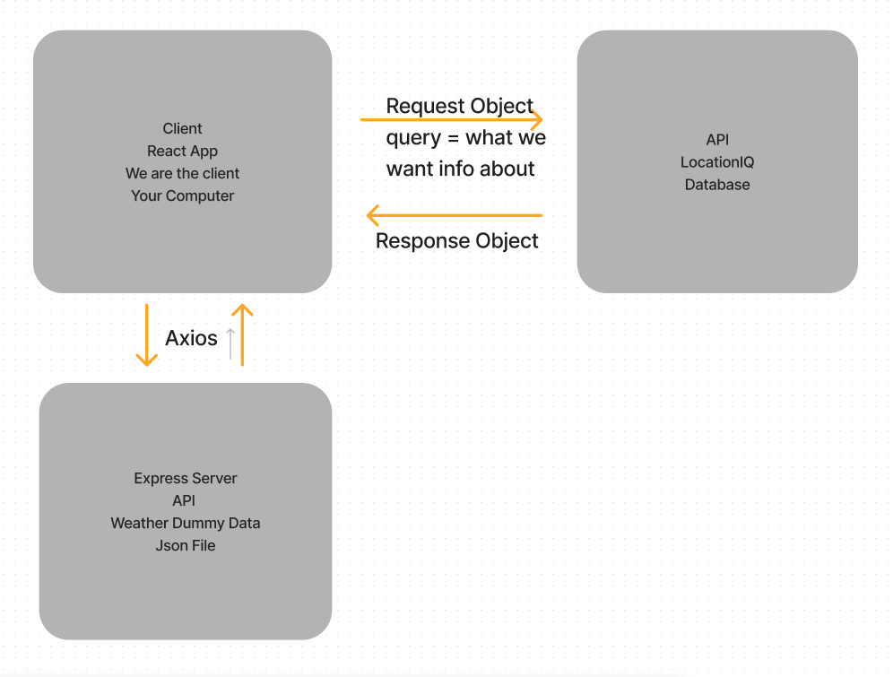
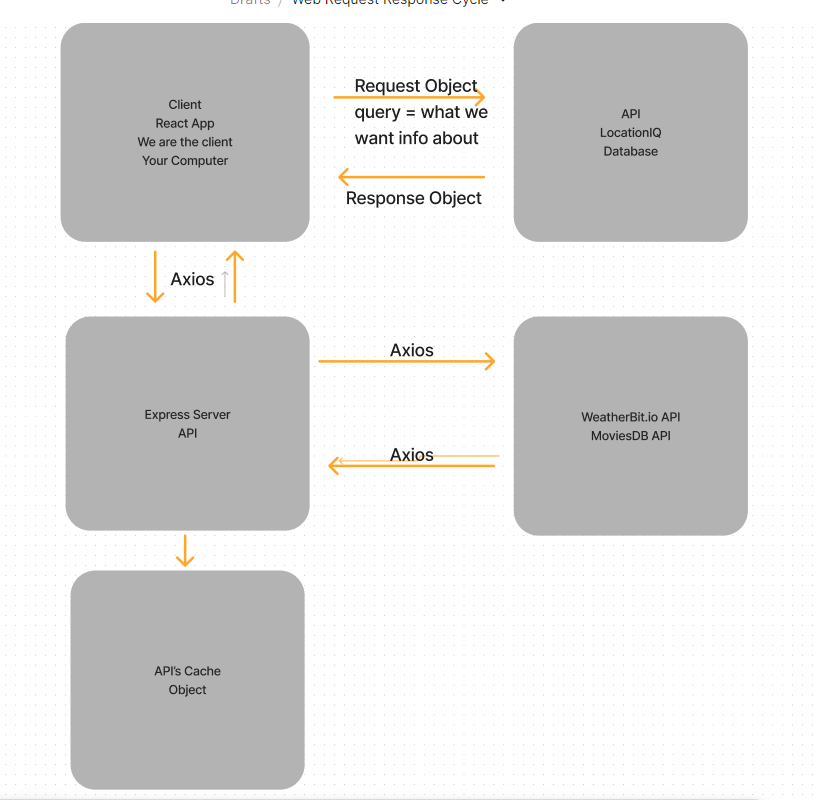

# City Explorer API

**Author**: Stacy Yu
**Version**: 4.0.0 (increment the patch/fix version number if you make more commits past your first submission)

## Overview
<!-- Provide a high level overview of what this application is and why you are building it, beyond the fact that it's an assignment for this class. (i.e. What's your problem domain?) -->

## Getting Started
<!-- What are the steps that a user must take in order to build this app on their own machine and get it running? -->

## Architecture
<!-- Provide a detailed description of the application design. What technologies (languages, libraries, etc) you're using, and any other relevant design information. -->

## Change Log
<!-- Use this area to document the iterative changes made to your application as each feature is successfully implemented. Use time stamps. Here's an example:

01-01-2001 4:59pm - Application now has a fully-functional express server, with a GET route for the location resource. -->

## Credit and Collaborations
<!-- Give credit (and a link) to other people or resources that helped you build this application. -->

---

## WRRC

---

Name of feature: Adding weather API to our app - Lab 7

Estimate of time needed to complete: 3 hours

Start time: 4pm

Finish time: 6pm..

Actual time needed to complete: 3hrs+

---

Name of feature: Adding weather and movies API to our app - Lab 8

Estimate of time needed to complete: 2 hours

1st attemp time: 7:30pm - 9:15pm, continued

Actual time needed to complete: 3 hrs 

---

Name of feature: Refactoring our code - Lab 9

Estimate of time needed to complete: 2 hours

1st attemp time: 3:00pm-4:30pm

Actual time needed to complete: Still working on making it look nice :)

---

Name of feature: Working with cache - Lab 10

Estimate of time needed to complete: 1 hour

1st attemp time: 7:00pm-8:30pm

Actual time needed to complete: 1 hr and 30 mins
